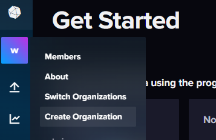

docker run -d --name telegraf-kafka --network="host" --volume $PWD/telegraf.conf:/etc/telegraf/telegraf.conf telegraf

# Manual Steps
1. login to influxdb http://localhost:8086/
2. create organization: organization = "weather" and bucket = "weather-data" (see telegraf config)
