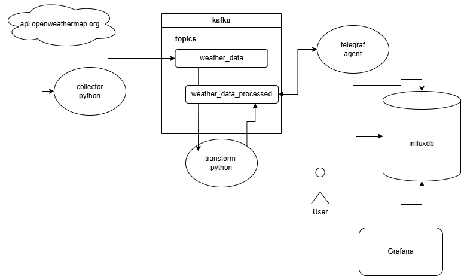
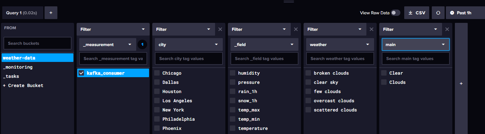

# Weather Data Engineering Project

This project is an end-to-end data engineering pipeline that collects weather data, processes it using Kafka, and consumes the data for further processing and storage. The project is organized into several components:

- `010_collection`: Collects weather data from the OpenWeatherMap API. Sends it to Kafka. Minute level frequency.
- `020_kafka`: Kafka setup for data streaming.
- `030_consumers`: Consumes data from Kafka, processes it, and sends it back to Kafka.
- `040_storage`: Telegraf consumes from processed Kafka Topic and loads into InfluxDB.

Each of these components will have README.md and image screenshots associated with them.

## Project Structure

## InfluxDB

## Next Steps:
* influxdb persistent storage strategy
* kafka persistent storage strategy for zookeeper
* kafka monitoring tool (kafka ui, burrow, etc)
* can convert Docker containers to docker compose images, or use kubernetes
* grafana layer for enhanced visuals

## References
* [telegraf](https://github.com/influxdata/telegraf)
* [influxdb](https://www.influxdata.com/)
* [kafka](https://hub.docker.com/r/confluentinc/cp-kafka)
* [kafka-zookeeper](https://hub.docker.com/r/confluentinc/cp-zookeeper)
* [weather-units](https://openweathermap.org/weather-data)

## Startup Order
1. Zookeeper
2. Kafka
3. influxDB
4. telegraf
5. consumer
6. collector