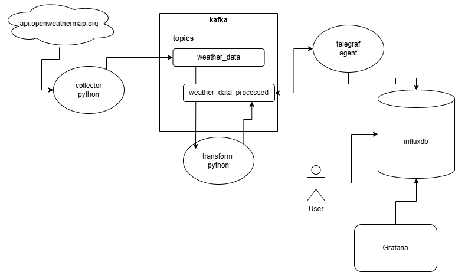

# Weather Data Engineering Project

This project is an end-to-end data engineering pipeline that collects weather data, processes it using Kafka, and consumes the data for further processing and storage. The project is organized into several components:

- `010_collection`: Collects weather data from the OpenWeatherMap API.
- `020_kafka`: Kafka setup for data streaming.
- `030_consumers`: Consumes data from Kafka and processes it.
- `040_storage`: Telegraf and InfluxDB setup

Each of these components will have README.md and image screenshots associated with them.

## Project Structure

## Next Steps:
* Fix data load into influxdb to include location and other field info
* influxdb persistent storage strategy
* kafka persistent storage strategy for zookeeper
* kafka monitoring tool (kafka ui, burrow, etc)
* can convert Docker containers to docker compose images, or use kubernetes

## Startup Order
1. Zookeeper
2. Kafka
3. influxDB
4. telegraf
5. consumer
6. collector